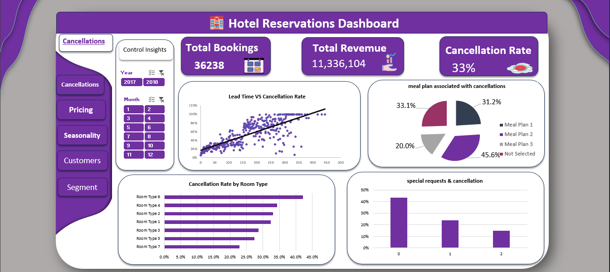
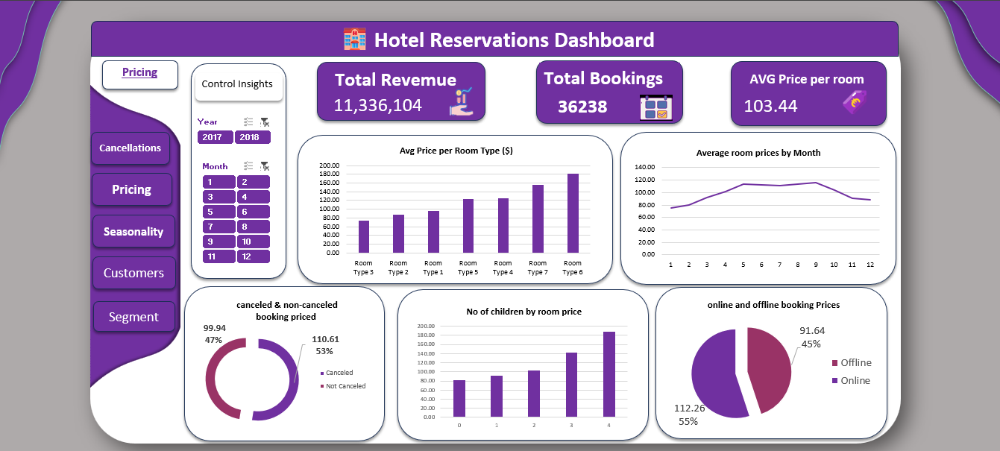
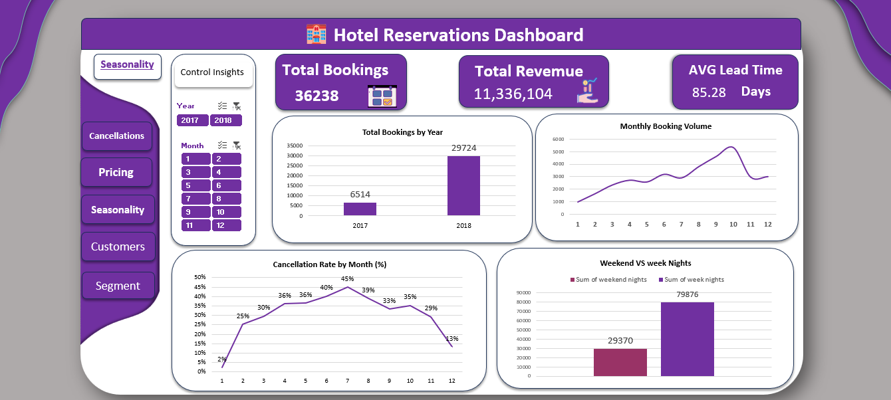
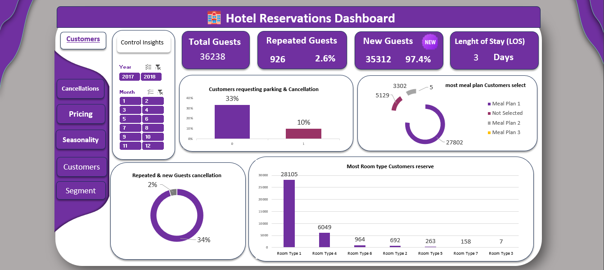
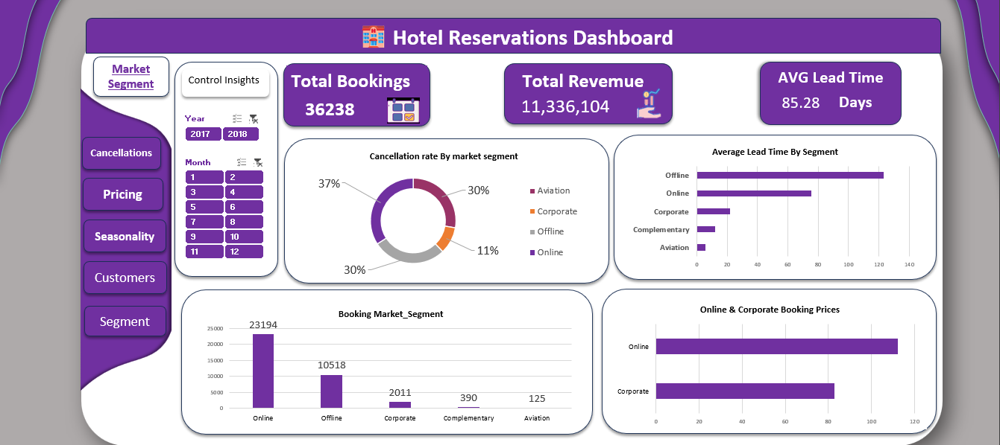

# 🏨 Hotel Reservations Dashboard — Tourism Project

An interactive multi-page hotel reservations analytics dashboard built entirely in **Microsoft Excel** using Power Pivot, Power Query, and DAX. The project transforms raw reservation data (2017–2018) into actionable business insights across 5 dashboard pages.

---

## 📊 Key KPIs

| Metric | Value |
|---|---|
| Total Bookings | 36,238 |
| Total Revenue | $11,336,104 |
| Cancellation Rate | 33% |
| Avg Lead Time | 85.28 Days |
| Avg Price Per Room | $103.44 |
| Avg Length of Stay | 3 Days |

---

## 🗄️ Data Model — Star Schema


The data is structured as a **Star Schema** in Power Pivot:

- **Fact_Reservations** — Core transaction table (lead time, pricing, parking, meal plan, booking status, special requests, and all foreign keys)
- **Dim_date** — Date dimension (Year, Quarter, Month, Day Name, Date_key)
- **Dim_Room** — Room type dimension
- **Dim_Meal_Type** — Meal plan dimension
- **Dim_Market_Seg** — Market segment dimension
- **Dim_Booking_Status** — Booking status dimension

---

## 📋 Dashboard Pages

### 1 — Cancellations


- Overall cancellation rate: **33%**
- Clear positive correlation between lead time and cancellation rate
- Room Type 6 has the highest cancellation rate (~45%), Room Type 7 the lowest
- Guests with no special requests cancel the most (~41%)
- "Not Selected" meal plan associated with the highest cancellations (45.6%)

---

### 2 — Pricing


- Avg price per room: **$103.44**
- Room Type 6 is the most expensive (~$175 avg)
- Room prices peak in summer months (April–September)
- Non-canceled bookings average $110.61 vs $99.94 for canceled ones
- Online channel avg price ($112.26) > Offline ($91.64)

---

### 3 — Seasonality


- 2017: 6,514 bookings → 2018: 29,724 bookings (significant growth)
- Booking volume peaks around months 9–10 (Sep–Oct)
- Highest cancellation month: July (45%) — Lowest: January (2%)
- Weekday nights (79,876) far outpace weekend nights (29,370)

---

### 4 — Customers


- New guests: **35,312 (97.4%)** — Repeated guests: 926 (2.6%)
- New guest cancellation rate: 34% vs 2% for repeat guests
- 33% of guests request parking, 10% of them cancel
- Most popular meal plan: "Not Selected" (27,802 bookings)
- Most reserved room type: Room Type 1 (28,105 bookings)

---

### 5 — Market Segment


- Online dominates with **23,194 bookings (64%)**
- Offline: 10,518 | Corporate: 2,011 | Complementary: 390 | Aviation: 125
- Offline segment has the longest avg lead time (~125 days)
- Corporate segment has the lowest cancellation rate (11%)
- Aviation segment has the highest cancellation rate (37%)

---

## 💡 Key Insights

- Longer lead times strongly correlate with higher cancellation rates — early bookings carry more risk
- Repeat guests cancel at only 2% vs 34% for new guests — loyalty programs are a major opportunity
- Guests who make special requests are significantly less likely to cancel
- Online channel drives the most volume but corporate drives higher revenue per booking
- Summer months bring peak demand but also peak cancellations
- Room Type 6 commands the highest price but also carries the highest cancellation risk
- 97.4% of guests are first-time visitors — strong acquisition, but retention is untapped

---

## 🛠️ Tools & Technologies

- **Microsoft Excel** — Primary development environment
- **Power Query** — Data import, cleaning, and transformation (ETL)
- **Power Pivot** — In-memory data model and star schema relationships
- **DAX** — Calculated measures and KPIs
- **PivotTables & PivotCharts** — Dynamic aggregations feeding all visuals
- **Slicers** — Interactive filters for Year and Month across all pages

---

## ▶️ How to Use

1. Open `Hotel Project.xlsx` in Microsoft Excel (2016 or later)
2. Enable editing and content if prompted
3. Navigate between pages using the left sidebar (Cancellations / Pricing / Seasonality / Customers / Segment)
4. Use the **Year slicer** (2017 / 2018) and **Month slicer** to filter all visuals simultaneously
5. All charts are PivotCharts and update automatically when slicers change

---

## 📁 File Structure

```
├── 2- Hotel Reservations.csv      # Raw data source
├── Hotel Project.xlsx             # Main workbook (data model + dashboards)
├── Star_Schema Model.png          # Data model diagram
├── Cancellation.png               # Cancellations dashboard screenshot
├── Pricing.png                    # Pricing dashboard screenshot
├── Seasonality.png                # Seasonality dashboard screenshot
├── Customers_page.png             # Customers dashboard screenshot
└── Market_segment.png             # Market segment dashboard screenshot
```
